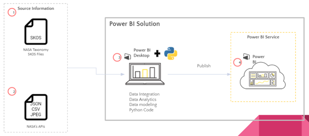
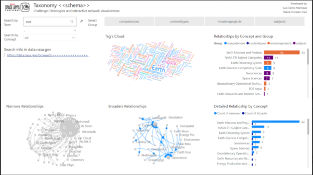

# space_apps_challenge 2021

---
## Project title
Connected with the universe

&nbsp;

## High-Level Project Summary
Astronomical information is gathered from multiple agencies around the world. However, this one is growing rapidly and there is not consensus in the taxonomy. This makes difficult to find specific information and wasting time is irremediable. 
For that reason, our goal is to find multiple relations in the released datasets, APIs, etc. from different agencies and visualize the mentioned relationships in a useful and interactive dashboard. We use techniques such as network graphs, text mining, clustering and NLP that help us to reach our main goal.
By doing this, private researchers and public researchers will find easily what they are looking for and may continue their investigation.

&nbsp;
 

## Link to Project "Demo"
[Google's folder](https://drive.google.com/drive/folders/1oDOLO0M2HkRY11LV7DCpxiJ2NSULUJ7Y?usp=sharing)

&nbsp;

## Link to Final Project
[space_apps_challenge/2021](https://github.com/luismanriqueruiz/space_apps_challenge)

&nbsp;

## Detailed Project Description

### General schema

#### Data Collection

The data is first of all collected from multiple sources, from NASA’s taxonomy website (1) that contains SKOS files as well as NASA’s APIs (2). The latter one provides several types of information in different formats like JSON, CSV, JPEG, etc.

#### Power BI Solution

The BI solution contains 2 parts: The data integration, analytics and modelling. In this step (3) we integrated python to analyze large texts by using text mining and NLP techniques. The last process is then uploading the solution into the Power BI service and visualization.

### Dashboard

The dashboard gathers and combine information from multiple Taxonomy SKOS and APIs. First of all, it introduces multiple relationships from NASA’s taxonomy. Information related to narrower and broader is shown as network graphs.

In the dashboard, the user or researcher may look for specific terms or concepts inside the field “search by Term” and “search by concept”. All the data comes from multiple sources such as SKOS files, datasets, APIs and several formats such as json, csv, png, etc.

This user’s search will update the visualization and the filtered data and graphs are shown. The user is informed about the related words and their frequencies (word cloud). The information from the “word cloud” does not come only from single fields but from long texts as well. These texts are processed using text mining techniques and NLP that allow us to find document term matrix, removing stop words, analyze distances between texts etc.

The benefits of using this dashboard or visualization are that the user will understand easily how specific terms and related and how to find this information inside NASA’s datasets. Also, because it is easy to use it.

We want to achieve, by creating this software, a much easier understanding of astronomical data through multiple charts. Also, another useful aspect is that the software creates automatically a URL query for the user, if he/she wants to delve into the NASA’s information.

We used mainly Power BI Desktop for visualizing and creating this dashboard. However, we also used python 3.9.7 (as backend system) to analyze and get different results in an automated way from the APIs. Also, by programing we were able to find relationships between their fields, make use of text mining and NLP techniques too.

## Space Agency Data
We use mainly NASA’s information; this one comes from multiple sources as follows:

APIS:
- APOD
- Asteroids - NeoWs
- DONKI
- Earth
- EONET
- EPIC
- Exoplanet archive
- GeneLab Public API
- InSight: Mars Weather Service API
- Mars Rover Photos
- NASA Image and Video Library
- TechTransfer
- SBDB Close-Approach Data API
- Techport
- TLE API
- Vesta/Moon/Mars Trek WMTS

Also, from NASA taxonomy 2.0.
 
In order to understand the complexity of the huge collection of information, we explored each of the mentioned APIS. By doing this (working as developers), we could get multiple samples, check different fields and relationships (Google’s doc: CommonVariables), and consider how it is possible the standardization and normalization. 

The different type of data, such as json structure, tables, pictures allow us to contemplate even more how can we help users and researchers to access any kind of astronomical information.

&nbsp;
 

## Hackathon Journey

The experience working on this hackathon has been terrific. Fortunately, the members of this team although they are not many, they know what they want and by using their specific experiences and knowledge the discussion is much richer.

Another interesting aspect is that both members are located in different countries. This situation allows them to work in different time zones and take breaks from time to time while the other one could continue working.
As a team we learned about the importance of the taxonomy and ontologies not only for NASA but for all the collected information around the world. It is mandatory to have a global consensus on how to handle and name the data or having specific organizations that could clean and organize it. 

Our team is formed by two people who have worked with astronomical information and are passionate about this subject. Also, our friendship became stronger and now we know more not only the capabilities of each other but also about the personality. For us, it was too important the respect of each other and having faster and clear communication about new ideas, setbacks, challenges. It helps us to be mesmerized on how the other person could see and solve an issue in an easier way. 

By having some discussions about our experiences, knowledge and capabilities we chose couple of challenges. However, this one is chosen since we have worked in the past with databases, file structures, visualizations, etc., and we are passionate of tiding information and make it more accessible for everyone.

We knew that visualizations are important for understanding the relationship between datasets. For that reason, we focused on this point. Another relevant topic network graphs, it not only helps us to see relationships but finding clusters too. Finally, text mining and NLP techniques were important in this project because we also delved into long texts and tried to find specific clusters and common topics among the data.

We would like to thank to Zaragoza’s board members for providing us not only comments but questions that help us to improve the final results. And also, to our families that know that we are passionate about this topic and in some way, we want to provide an idea of how to solve this humanity challenge.

&nbsp;

## References

### Data
APIS:
- APOD
- Asteroids - NeoWs
- DONKI
- Earth
- EONET
- EPIC
- Exoplanet archive
- GeneLab Public API
- InSight: Mars Weather Service API
- Mars Rover Photos
- NASA Image and Video Library
- TechTransfer
- SBDB Close-Approach Data API
- Techport
- TLE API
- Vesta/Moon/Mars Trek WMTS

Also, from NASA taxonomy 2.0.

### Resources
 
#### Tools
[Power BI Desktop 2.97](https://www.microsoft.com/en-us/download/details.aspx?id=58494)

Python 3.9.7 libraries: 
- pandas
- json
- rdfpandas
- rdflib
- matplotlib
- sklearn,
- nltk

Instructions configurate Python to Power BI
[Run Python Scripts in Power BI Desktop - Power BI | Microsoft Docs]
(https://docs.microsoft.com/en-us/power-bi/connect-data/desktop-python-scripts)

#### Tags
#ontologies, #visualizations, #apis, #datasets, #networkGraphs

&nbsp;

## Future work

This project can be extended by including even more APIs, analyzing more relationships between long texts in different fields.

Also, it is required a terms unifications globally in order to find the information in a simple way and thus reduce time.

Finally, the algorithms are scalable but it is required to use a complex infrastructure to elaborate network graphs to identify connections.