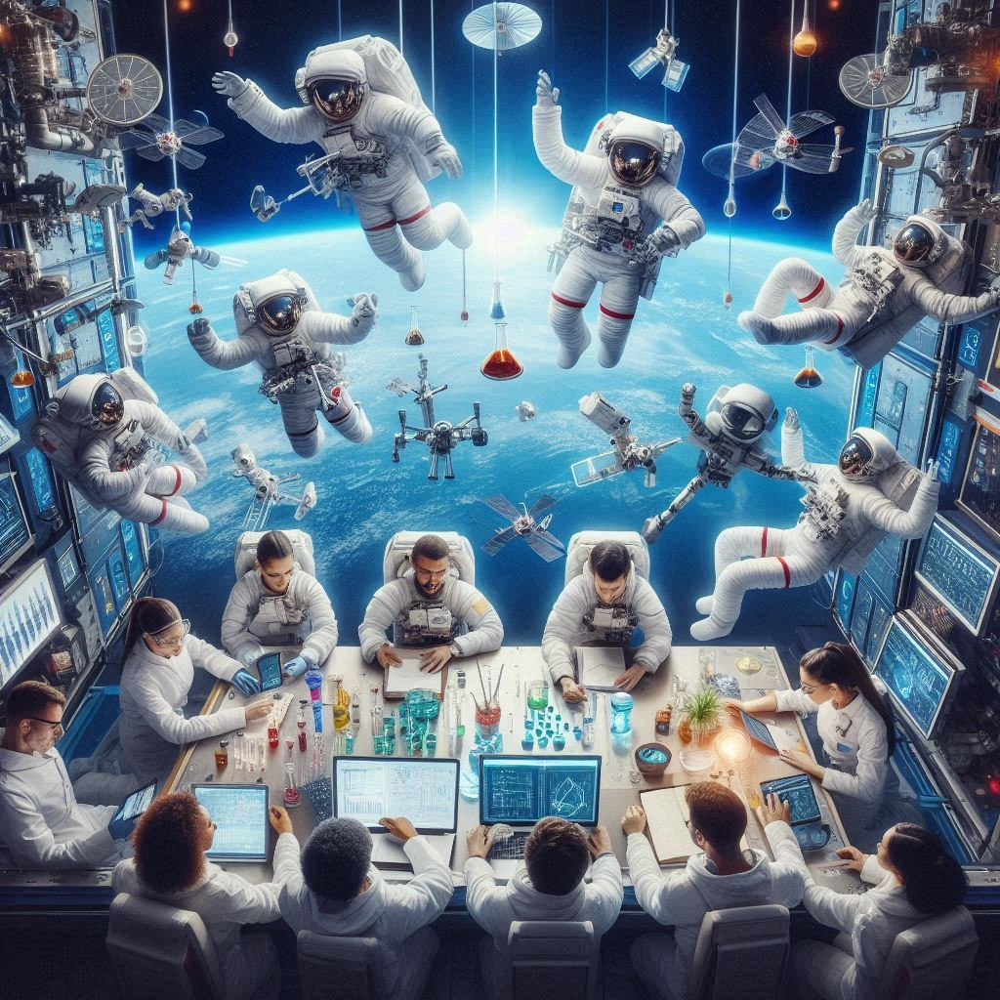
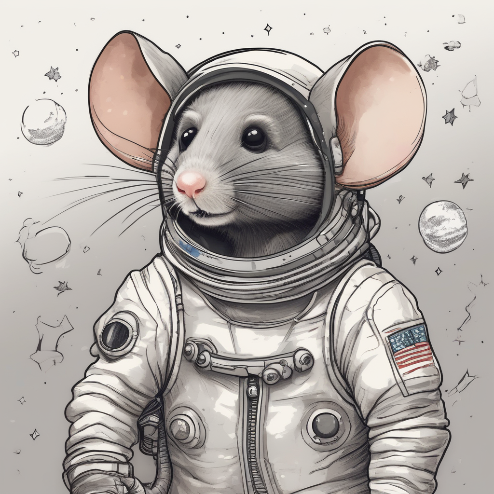

# NASA Space Apps challenge 2024

## Challenge:
**Visualize Space Science**

Biological experiments performed in space are critical to scientific discovery efforts, but they are complex to execute and difficult to conceptualize. For example, these experiments must be loaded into rockets, launched, performed using specialized hardware, and (oftentimes) returned to Earth for analysis. This complexity is a barrier to the broad utilization of this data. Your challenge is to create a tool that can generate informative and compelling visualizations of biological experiments performed in space.

## Members

- [Sandra Puentes](https://www.linkedin.com/in/sandra-puentes/)
- [Luis Carlos Manrique R](https://www.linkedin.com/in/luiscmanrique/)

## Table of contents

### High-Level Summary

Our main idea was to organize relevant information from the experiments conducted on the International Space Station (ISS) and present it in an easily understandable format. We used generative AI to analyze descriptions and protocols to answer fundamental questions for each investigation. Additionally, we generated images by extracting the most important sentences identified by GPT-4o to give readers an idea of the investigation. Finally, we recognized that 'visualization' only reaches a limited audience, so we explored ways to create exciting podcasts about the investigations that anyone can listen to or share at any time.

Given that creating the images and podcast takes time, we have done it for two experiments: `379` and `665`. However, this app can be used for any experiment registered in the Open Science Data Repository.

Finally, as the cherry on top 🍨, we provided a link to the astronomy picture of the day when the experiment's documentation was released.

### Project Demo
- Video

### Final Project
- [Space Apps 2024 URL](https://streamlit-app-88387863998.us-central1.run.app)

- [Space Apps 2024 Repository]

### Project Details
- **Image generation**: Stable diffusion models were tested using Python 3.12 [Ref](./documentation/Image_generation.ipynb). However, the results from Microsoft Bing Image Creator were appropriated for sharing given the time and resources to develop this app and the investigation on how to create images using generative AI.

- **Podcast details**: More information on how the podcast was created can be accessed [here](./documentation/podcast_creation_science_for_all.md)

- **Extracting fundamental questions and answers**: The API's endpoints were studied to extract the information related to the experiments. We extracted the content from descriptions and protocols; however, information such as materials and parameters were also considered. We contemplated using Bidirectional encoder representations from transformers (BERT); nevertheless, the model should be finetuned for this type of information. Therefore, LLMs were finally chosen since they are trained with vast information and can provide good results.

- **Deploying the app**: This web app was developed using Python 3.12 on Ubuntu 24.04.1 LTS with Anaconda. Docker was utilized for containerization, and the app was later deployed on Google Cloud. Special thanks to NASA and Google for their financial support and infrastructure.

### Use of Artificial Intelligence

Artificial intelligence was used to:
- Generate the logo 🖼️ of our team: It was done using Microsoft Bing Image Creator.
- Create images for the investigation 📷 : It was done using Microsoft Bing Image Creator.
- Transform the text into layman terms: By using OpenAI ChatGPT GPT-4o.
- Answer fundamental questions about the research: By using OpenAI ChatGPT GPT-4o.
- Create a podcast: By using Google's notebook.

### Space Agency Data
- [Open Science Data Repository](https://osdr.nasa.gov)
- [Astronomy Picture of the Day](https://apod.nasa.gov/apod)

### References
- [Microsoft Bing Image Creator](https://copilot.microsoft.com/images/create)
- [Open AI ChatGPT GPT-4o](https://chatgpt.com/)
- [Google NotebookLM](https://notebooklm.google.com)
- [Bidirectional encoder representations from transformers (BERT)](https://en.wikipedia.org/wiki/BERT_(language_model))

## Acknowledgments
[Wei Hong Chin](https://www.linkedin.com/in/wei-hong-chin-68907650/) for our talks on AI applications.